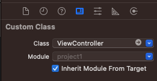
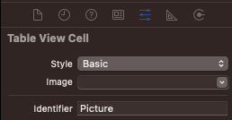

# Project 1

> List all the files in our app's directory, and pull out the ones that start with "nssl".


### 1. ViewController.swift

```swift
// ViewController.swift
import UIKit

class ViewController: UIViewController {

    override func viewDidLoad() {
        super.viewDidLoad()
        // Do any additional setup after loading the view.
    }
}
```

1. The file starts with `import UIKit`, which means “this file will reference the iOS user interface toolkit.”
2. The `class ViewController: UIViewController` line means “I want to create a new screen of data called ViewController, based on UIViewController.” When you see a data type that starts with “UI”, it means it comes from UIKit. `UIViewController` is Apple’s default screen type, which is empty and white until we change it.
3. The line `override func viewDidLoad()` starts a method. As you know, the `override` keyword is needed because it means “we want to change Apple’s default behavior from `UIViewController`.” `viewDidLoad()` is called by UIKit when the screen has loaded, and is ready for you to customize.
4. The `viewDidLoad()` method contains one line of code saying `super.viewDidLoad()` and one line of comment (that’s the line starting with `//`). This `super` call means “tell Apple’s `UIViewController` to run its own code before I run mine,” and you’ll see this used a lot.


### 2. `UIViewController`

```swift
class ViewController: UIViewController {

    override func viewDidLoad() {
        super.viewDidLoad()
        
        let fm = FileManager.default
        let path = Bundle.main.resourcePath!
        let items = try! fm.contentsOfDirectory(atPath: path)

        for item in items {
            if item.hasPrefix("nssl") {
                // this is a picture to load!
            }
        }
    }
}
```

- The line `let fm = FileManager.default` declares a constant called `fm` and assigns it the value returned by `FileManager.default`. This is a data type that lets us work with the filesystem, and in our case we'll be using it to look for files.
- The line `let path = Bundle.main.resourcePath!` declares a constant called `path` that is set to the resource path of our app's bundle. Remember, a bundle is a directory containing our compiled program and all our assets. So, this line says, "tell me where I can find all those images I added to my app."
- The line `let items = try! fm.contentsOfDirectory(atPath: path)` declares a third constant called `items` that is set to the contents of the directory at a path. Which path? Well, the one that was returned by the line before. As you can see, Apple's long method names really does make their code quite self-descriptive! The `items` constant will be an array of strings containing filenames.
- The line `for item in items {` starts a loop that will execute once for every item we found in the app bundle. Remember: the line has an opening brace at the end, signaling the start of a new block of code, and there's a matching closing brace four lines beneath. Everything inside those braces will be executed each time the loop goes around.
- The line `if item.hasPrefix("nssl") {` is the first line inside our loop. By this point, we'll have the first filename ready to work with, and it'll be called `item`. To decide whether it's one we care about or not, we use the `hasPrefix()` method: it takes one parameter (the prefix to search for) and returns either true or false. That "if" at the start means this line is a conditional statement: if the item has the prefix "nssl", then… that's right, another opening brace to mark another new code block. This time, the code will be executed only if `hasPrefix()` returned true.
- Finally, the line `// this is a picture to load!` is a comment – if we reach here, `item` contains the name of a picture to load from our bundle, so we need to store it somewhere.


### 3. `UITableViewController`

1. `project1/project1/ViewController.swift`
   - `UIViewController` → `UITableViewController`

```swift
import UIKit // this file will reference the iOS user interface toolkit.

class ViewController: UITableViewController {
}
```

2. `Project1/Project1/Main.storyboard`

   - Delete `View Controller Scene`
   - `Cmd` + `Shift` + `L` (for object library)
   - Click `Table View Controller`

   - Activate `Identity Inspector` by using  `Alt` + `Cmd` + `4` in order to connect the `Main.storyboard` to  `ViewController.swift`

     - `Custom Class` > `Class` > `ViewController`

     

   - Go to `Attributes Inspector` and check the box says `Is Initial View Controller` under View Controller

      

   - `Editor` -> `Embed In` -> `Navigation Controller`

   - 